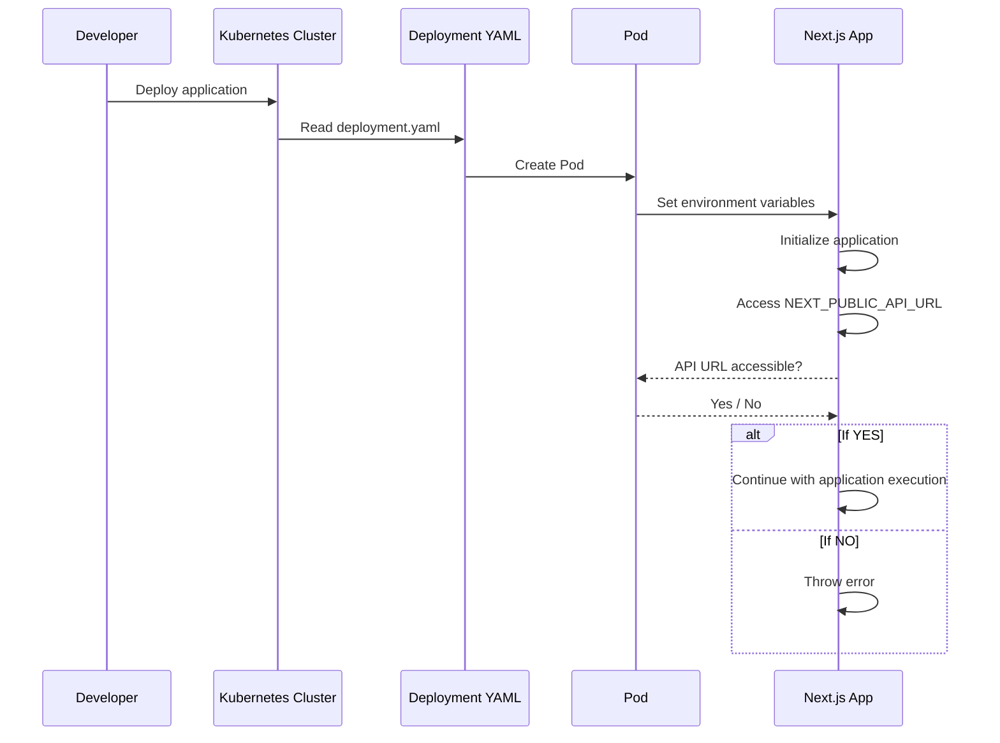

# Starter Template para Next.js - Problem

Este proyecto es una plantilla inicial para aprender y construir aplicaciones con [Next.js](https://nextjs.org/learn).

## Requisitos
[Docker](https://docs.docker.com/get-docker/)

[Kubernetes](https://kubernetes.io/es/docs/home/)

[Minikube](https://minikube.sigs.k8s.io/docs)

[Kubectl](https://kubernetes.io/es/docs/tasks/tools/install-kubectl/)

## Problema

Al desplegar la aplicación en un entorno Dockerizado usando Minikube (o cualquier otro clúster de Kubernetes), no se reconocen las variables de entorno definidas en el archivo `deployment.yaml`. Aunque el uso de un archivo `.env` soluciona el problema, no es recomendable utilizar este método en un entorno de producción en Kubernetes.

## Descripción del Problema

La aplicación en Next.js necesita acceder a una URL específica proporcionada por una variable de entorno, denominada `NEXT_PUBLIC_API_URL`. Sin embargo, cuando se levanta la aplicación en Kubernetes, no se logra acceder a esta variable de entorno configurada en el archivo `deployment.yaml`.

## Objetivo

Identificar y aplicar una metodología eficiente para manejar las variables de entorno en Kubernetes para aplicaciones Next.js, evitando el uso de archivos `.env`.

## Solución Propuesta

Explorar alternativas para la correcta inyección de variables de entorno en el clúster de Kubernetes, asegurando que la aplicación pueda acceder a estas de manera segura y eficiente.

## Pasos Siguientes

1. Revisar la configuración actual del `deployment.yaml` para asegurarnos de que las variables de entorno están definidas correctamente.
2. Investigar métodos recomendados por la comunidad de Kubernetes para la gestión de variables de entorno en aplicaciones en contenedores.
3. Implementar la solución y verificar que `NEXT_PUBLIC_API_URL` es accesible dentro de la aplicación.

## Pruebas en entorno local
Crear un archivo .env en la raíz del proyecto con la siguiente variable de entorno:

```
NEXT_PUBLIC_API_URL=https://pokeapi.co/api/v2/pokemon/ditto
```

Y luego corre el proyecto:


```
npm run dev
```

Esto funciona correctamente en un entorno local, pero al desplegar la aplicación en un clúster de Kubernetes, la variable de entorno `NEXT_PUBLIC_API_URL` no es accesible.

## Pruebas en entorno producción

Para simular el despliegue de la aplicación en un clúster de Kubernetes, utilizaremos Minikube, un entorno local de Kubernetes que nos permite probar nuestras aplicaciones en un entorno similar al de producción.

1. Iniciar Minikube:

``` 
minikube start
```

2. Crear un archivo `deployment.yaml` para desplegar la aplicación en el clúster de Kubernetes, este ya se encuentra en el repositorio, puede ser modificado hasta llegar a la solución.

3. Aplicar el archivo `deployment.yaml`:

```
kubectl apply -f deployment.yaml
```
- Actualizamos el deployment de forma forzada
```
kubectl rollout restart deployment nextjs-app
```

4. Verificar que la aplicación se ha desplegado correctamente:

```
kubectl get pods
```

5. Acceder al pod de la aplicación:

```
kubectl exec -it <pod-name> -- /bin/sh
```

6. Dentro del pod, verificar que la variable de entorno `NEXT_PUBLIC_API_URL` es accesible:

```
echo $NEXT_PUBLIC_API_URL
```

7. Conecta tu Docker CLI al daemon de Docker en Minikube
    
```
eval $(minikube docker-env)
```
8. Obtener url del serivicio

```
minikube service nextjs-service --url
```


## Diagrama 

