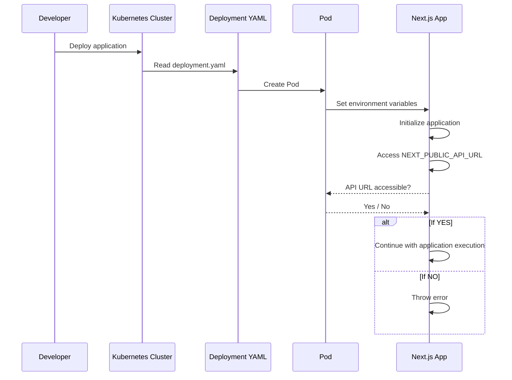

# Starter Template para Next.js

Este proyecto es una plantilla inicial para aprender y construir aplicaciones con [Next.js](https://nextjs.org/learn).

## Requisitos
Docker
Kubernetes
Minikube
Kubectl

## Problema

Al desplegar la aplicación en un entorno Dockerizado usando Minikube (o cualquier otro clúster de Kubernetes), no se reconocen las variables de entorno definidas en el archivo `deployment.yaml`. Aunque el uso de un archivo `.env` soluciona el problema, no es recomendable utilizar este método en un entorno de producción en Kubernetes.

## Descripción del Problema

La aplicación en Next.js necesita acceder a una URL específica proporcionada por una variable de entorno, denominada `NEXT_PUBLIC_API_URL`. Sin embargo, cuando se levanta la aplicación en Kubernetes, no se logra acceder a esta variable de entorno configurada en el archivo `deployment.yaml`.

## Objetivo

Identificar y aplicar una metodología eficiente para manejar las variables de entorno en Kubernetes para aplicaciones Next.js, evitando el uso de archivos `.env`.

## Solución Propuesta

Explorar alternativas para la correcta inyección de variables de entorno en el clúster de Kubernetes, asegurando que la aplicación pueda acceder a estas de manera segura y eficiente.

## Pasos Siguientes

1. Revisar la configuración actual del `deployment.yaml` para asegurarnos de que las variables de entorno están definidas correctamente.
2. Investigar métodos recomendados por la comunidad de Kubernetes para la gestión de variables de entorno en aplicaciones en contenedores.
3. Implementar la solución y verificar que `NEXT_PUBLIC_API_URL` es accesible dentro de la aplicación.

## Diagrama 

